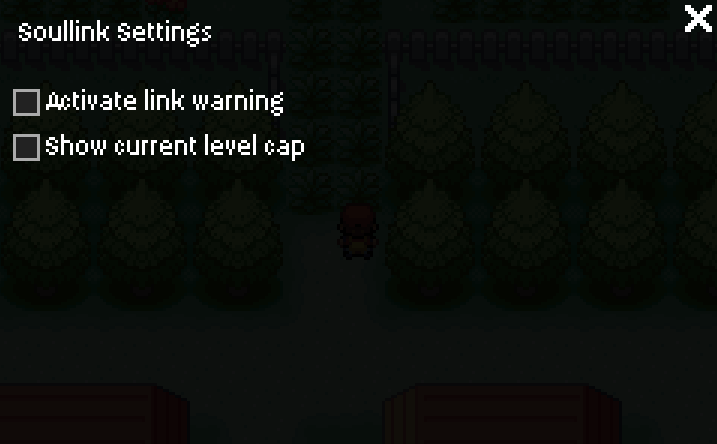

# Soullink Tracker Extension for Ironmon Tracker

This is an extension for the [Gen 3 Ironmon Tracker](https://github.com/besteon/Ironmon-Tracker), intended to add a tracker for a Soullink Challenge.

It uses the internal Ironmon UI, so you can use it directly in the [Bizhawk Emulator](https://github.com/TASEmulators/BizHawk) without needing an extra website or manually renaming Pokémon.  

Currently supported games: **Pokémon FireRed/LeafGreen**.

## Features
- Add Soullinks
- Have an Overview over all current Links
- Banlist (e.g. for accidentally killed Pokémon or Routes)
- Display the current Level Cap (optional, toggle in options)
- Display indicators if you have banned or already have/had a link on the current route (optional, toggle in options)
  
## Screenshots

### Overview Screen

### Link Screen

### Banlist Screen

### Settings

## Installation
1. Click the **Gear icon** on the Tracker screen to access the settings  
2. Click the **Extensions** button  
3. Go to the **General** tab  
4. Click **Install a new extension**  
5. Copy/Paste the this URL into the textbox: https://github.com/stableneo/Soullink-Tracker-IronmonExtension
6. Click **Install Extension**

## Notes
- Only tested with **Pokémon FireRed/LeafGreen** so far
- The Levelcap system isnt fully tested, could be buggy
- Requires the **Ironmon Tracker** to be installed in BizHawk

## Development
This project builds on the [Ironmon Tracker Extension Template](https://github.com/besteon/Ironmon-Tracker/tree/main/extensions).  
Contributions and improvements are welcome!